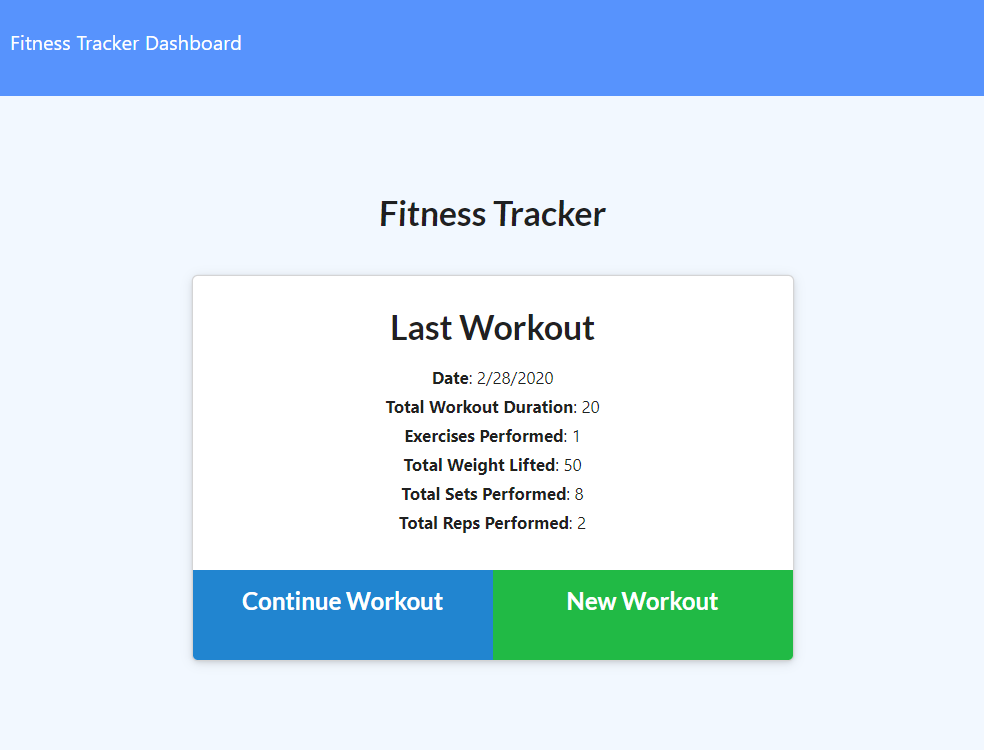
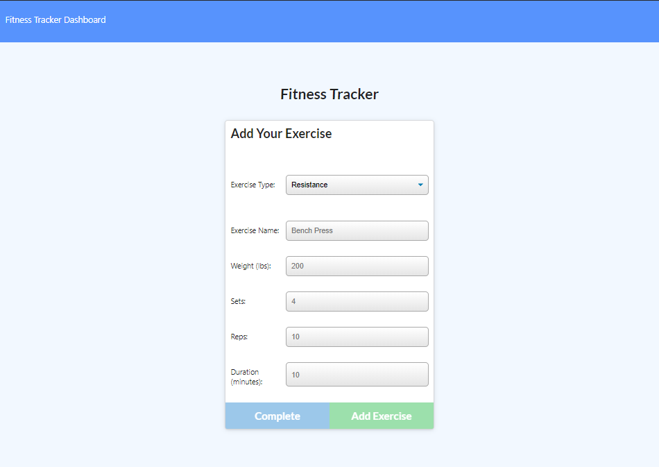
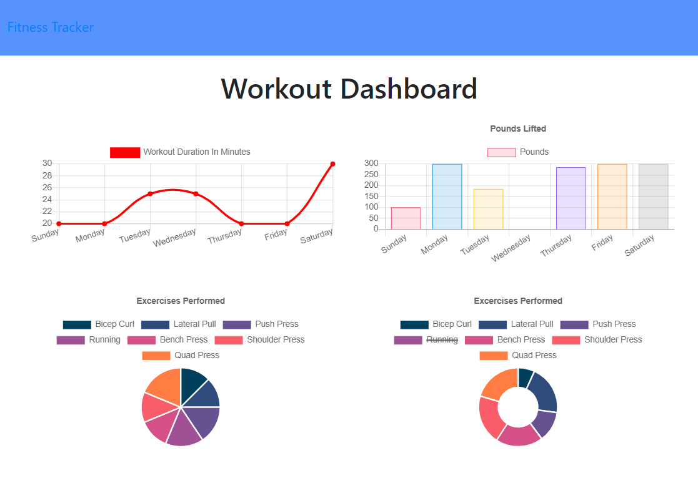

# Homework Week 17 - Fitness Tracker

This workout tracker application is created with a Mongo database and Mongoose schema. The routes are handled with Express and pulls/processes fitness data and statistics to display on the front end of the application. 

## User Story

```
As a user, I want to be able to view, create, and track daily workouts,
so that I can reach my fitness goals. 
```

## Composition of Application

On server start (or in the deployed application) -

From the homepage, the user sees at a glance tallied statistics of the last workout that was modified. They can choose to add exercises to the last created workout entry (date stamped), to create a new workout entry, or to view the stats page. 

If the user selects to edit existing or create a new workout entry, they navigate to the "exercise" page, can add either cardio or resistance type exercises, and are prompted to enter the appropiate information. 

For resistance: name of exercise, duration, weight, reps, sets.
For cardio: name of exercise, duration, distance.

Only exercise type, name of exercise, and duration are required fields in order to write to the Mongo database.

A user can continue to add more exercises, return to the homepage, or navigate to the stats page.

## Process

The server.js file is first set up to require the dependencies and models, and to create the PORT and the mongoose connection to MongoDB. The HTML and API routes used for the application are also written in the server file. Postman was used to test and validate the created API routes. 

The mongoose models are coded in the workout.js file in the models folder. A mongoose vitual (property) is used to tally the total duration of the most recent workout (to display on the home page) without writing to the database. The front end html, css and javascript code are included in the public folder. The seed data is run with "npm run seed", and used for testing API requests and the associated front end display of data.

The dependencies for the application are listed in the package.JSON file and a gitignore file is used to to skip and prevent upload of the node_modules folder to GitHub. 

Heroku deployment required the setup of the mLab MongoDB add on.

## Deployment

he completed application is available for download on Github: 
https://github.com/jenjch/fitnessTracker

Images of the application:





The deployed application is hosted on Heroku:
https://fitness-tracker-022920.herokuapp.com/ 

## Acceptance Criteria

All requirements are met for application deployment. Feedback on improvements is appreciated.

## License

MIT license Copyright (c) 2020 Jenny Chen 
https://choosealicense.com/licenses/mit/ 
